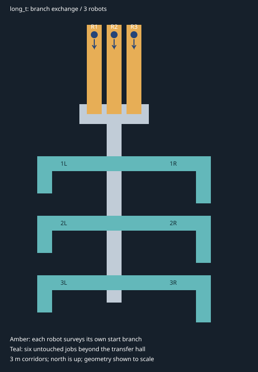

# long_t: branch exchange



This replaces the original three-ended T with a 695 m² nominal floor layout
designed to expose useful map sharing **before first team coverage**:

- Three 3 m wide start branches, each 18 m long from y=0 to y=18, at
  x=-4, 0 and 4. The common transfer hall spans x=-7..7 and y=-2..2.
- Each robot begins at y=16, facing south. It surveys its own branch on the
  way out; no prior map, script, waypoint or branch assignment is fed to it.
- A 3 m wide southbound spine leads to three pairs of work branches at
  y=-10, -22 and -34. Left branches turn at x=-14 and extend 6 m south;
  right branches turn at x=18 and extend 8 m south. There are six jobs for
  three robots, with unequal lengths and occluded tips.
- Walls are 0.2 m thick and 2 m high. All junctions are open floor unions.

The near alternatives in the hall are the teammates' start branches. Their
far ends remain hidden from another branch's approach. Under `none`, those
branches can still look valuable. With timely maps, their frontiers disappear
and the southern work remains valuable. The correct choice no longer rests
solely on a left/right tie at the old T junction. Further branch choices occur
before the six work areas are all covered.

This is a deliberately diagnostic scenario. It does not establish that every
map, policy, or trial benefits from communication. In particular, a shared map
does not allocate future targets: oracle robots may still converge on the
same remaining work. Only closed-loop trials can establish the effect on
first-coverage time.

## Starts and launch

`SPAWN_PRESET=distributed`, with exactly three robots:

| Robot | x | y | yaw |
|---|---:|---:|---:|
| robot1 | -4 | 16 | -π/2 |
| robot2 | 0 | 16 | -π/2 |
| robot3 | 4 | 16 | -π/2 |

`reversed` swaps robot1 and robot3 to test robot identity/startup ordering.
The wrapper also uses these separated positions for multi-robot `default`;
one robot uses (0,16). More than three robots are rejected rather than stacked.

For the initial none/oracle comparison, set these entries in experiment.conf:

```sh
NUM_ROBOTS=3
SPAWN_PRESET=distributed
EXPLORE_START_STAGGER_S=0
IMPAIRMENT_MODE=sim
LINK_PROFILE=static
BANDWIDTH_KBPS=0
LOSS_PCT=0
DELAY_MS=0
RECORD_METRICS=true
```

Keep the same robot model and `visible_gain` explorer configuration in both
arms. Set `MAP_TRANSPORT=none`, run `./docker.sh long_t`, then repeat with
`MAP_TRANSPORT=oracle`. Editing experiment.conf is intentional: the wrapper
sources it, so an exported value may be overridden. No transport-specific
policy or special start delay is required. Existing runs should be labelled
with their world/code revision; the name `long_t` now refers to new geometry.

Alternatively, the existing runner can alternate the arms:

```sh
python3 tools/run_experiment_sweep.py --world long_t --methods none,oracle --min-runs 3 --target-runs 3 --duration 1200
```

1200 is a pilot wall-time cap, not a validated completion time. The runner
currently times from all robots' first goals using wall time. Compute final
coverage endpoints on a common simulation clock, including the initial branch
survey. Use enough runtime for the chosen robot's speed; report runs that do
not reach the threshold, rather than discarding them. Keep startup/release
timing recorded: the idealized check below assumes all three initial surveys
are available when robots make their transfer decision.

After verifying the oracle/none mission gap, hold layout, policy and starts
fixed and add bandwidth-limited baseline/zstd/vxch arms. Do not tune geometry
separately for whichever transport is being evaluated.

## What has actually been checked

`tools/check_long_t_decisions.py` rasterizes the **SDF collision boxes**,
generates ideal local observations along three straight approaches, and calls
the repository's actual `visible_gain` selector. Each robot then follows
known-free BFS paths independently, collecting more local observations until
it crosses either a teammate's branch gate (y>2.5, 0.5 m beyond the hall) or the
work-spine gate (y<-4). Oracle receives the union of the three approach maps;
none receives only its own map. The physical geometry and local start state
are identical across the two arms.

At 0.1 m raster resolution, with both 3.5 m and 10 m idealized lidar:

| Observation range | None | Oracle | Team-unobserved floor at checkpoint |
|---|---|---|---:|
| 3.5 m | 3/3 enter a peer start branch first | 3/3 enter work spine first | ~492 m² |
| 10 m | 3/3 enter a peer start branch first | 3/3 enter work spine first | ~472 m² |

These are deterministic **mechanism checks**, not six independent mission
trials or evidence of a percentage reduction in completion time. The harness
has perfect poses, a prescribed initial approach, dense 360° scans, and no
robot bodies, costmap inflation, SLAM errors, Nav2 recovery, or goal preemption.
Small hall-corner observations may precede the measured gate crossing. It
does not measure the time to survey a duplicated branch. Do not present its
path lengths as mission savings. Gazebo and ROS closed-loop validation is
still required.

Run the check in a Python environment with NumPy (and pytest for tests):

```sh
python3 tools/generate_long_t.py --check
python3 tools/check_long_t_decisions.py --json-out /tmp/long_t_decisions.json
python3 -m pytest tools/tests/test_long_t.py -q
```

Tests also check boundary closure, connected free floor, matching visual and
collision geometry, distinct starts with at least 1.4 m wall clearance, and
routes to all six tips with a conservative 1 m square footprint.

## Measure the right endpoint

Primary: the first simulation time at which the union of all three **raw
local SLAM observation sets** reaches the reference coverage target. Do not
use per-robot completion or received/fused-map size. Include the initial
surveys; those observations count toward first coverage too.

Use the static collision world to define a common evaluation mask.
`geometry.json` contains floor rectangles and region names for this purpose;
union overlapping rectangles, subtract wall footprints and exclude exterior
space. Its 695 m² is nominal geometric floor, not a guarantee of 695 m² of
observable SLAM cells. Rasterization, wall corners and observability must be
accounted for consistently when defining literal 100% coverage. Report fixed
95%/99% thresholds alongside 100% if isolated map cells dominate the endpoint.
Do not publish this reference geometry to the robots.

Secondary: repeated start-branch entries and team distance accumulated
**before** first coverage. The mechanistic signature is robot N entering
another initial branch after that branch has been physically surveyed, while
southern work remains unobserved. Confirm the actual event in the bags rather
than treating the idealized checkpoint as guaranteed runtime behavior.

`tools/generate_long_t.py` is the source of truth for the SDF, overview and
geometry metadata. Regenerate all three together after geometry changes.
